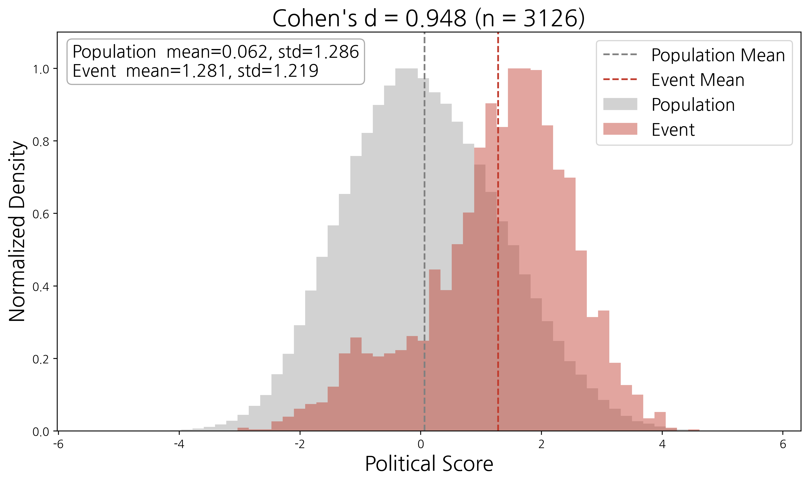
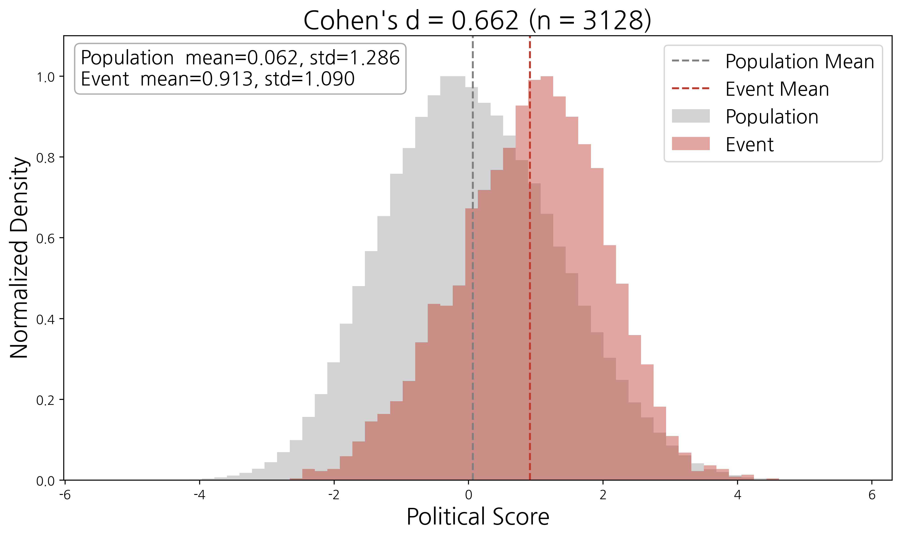
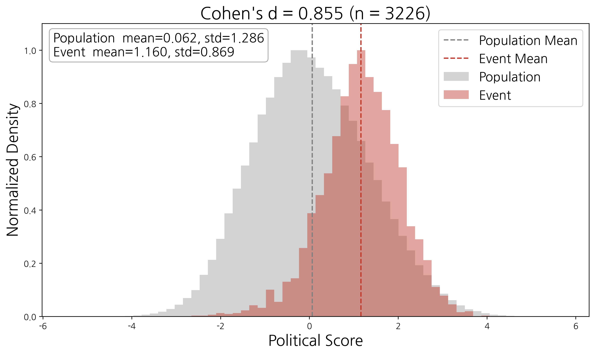
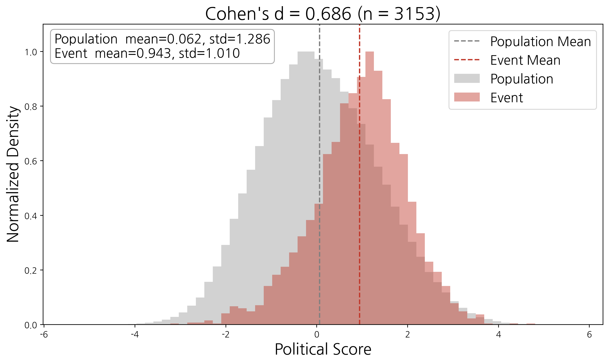
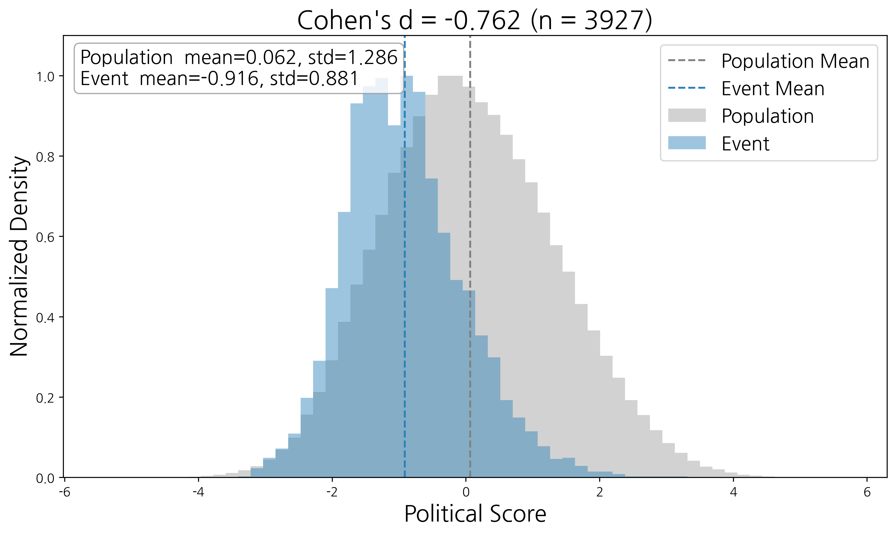
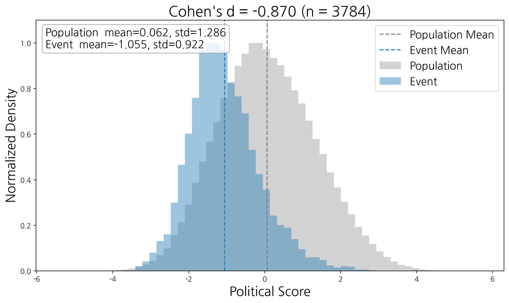
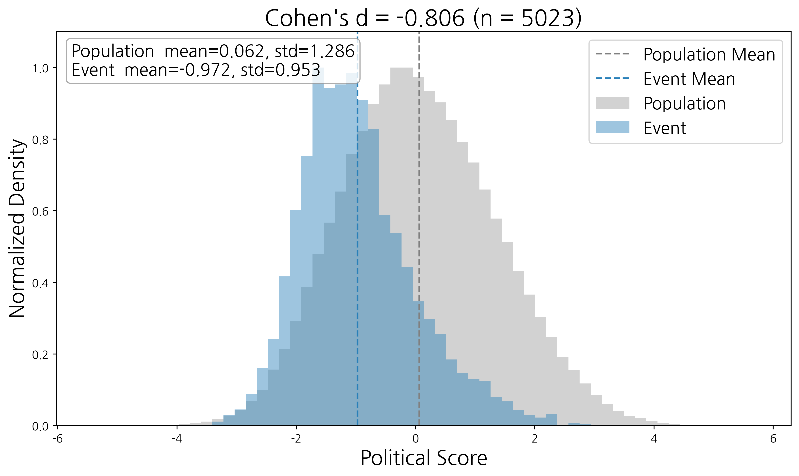
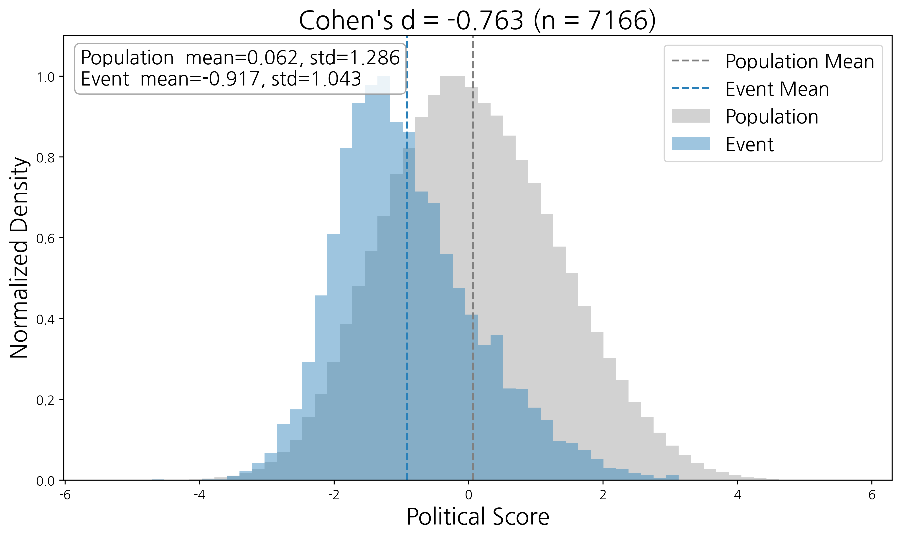

## Event Distribution Examples

The figures below compare the political score distribution of participants in representative political events with that of the overall user population. The gray histogram represents the overall population, while the colored histogram represents participants in a specific event. Both distributions are peak-normalized to facilitate comparison of their shapes rather than their absolute frequencies. Vertical dashed lines indicate the mean political scores of the overall population and the event participants.

<table>
<tr>
<td align="center">
 
<b>Event 1</b>
</td>
<td align="center">
 
<b>Event 2</b>
</td>
<td align="center">
 
<b>Event 3</b>
</td>
<td align="center">
 
<b>Event 4</b>
</td>
</tr>

<tr>
<td align="center">
 
<b>Event 5</b>
</td>
<td align="center">
 
<b>Event 6</b>
</td>
<td align="center">
 
<b>Event 7</b>
</td>
<td align="center">
 
<b>Event 8</b>
</td>
</tr>
</table>

The event histograms are color-coded according to their dominant political orientation: **blue** indicates events with relatively progressive-leaning participants, while **red** indicates events with relatively conservative-leaning participants. The title of each figure reports Cohen's *d* and the number of matched participants used in the analysis.

**Additional event visualizations are available in the [`images/`](images/) directory, which contains the complete set of event distribution figures generated in this study.**